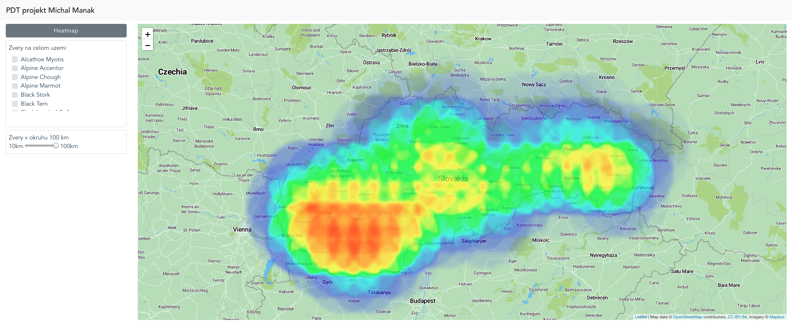
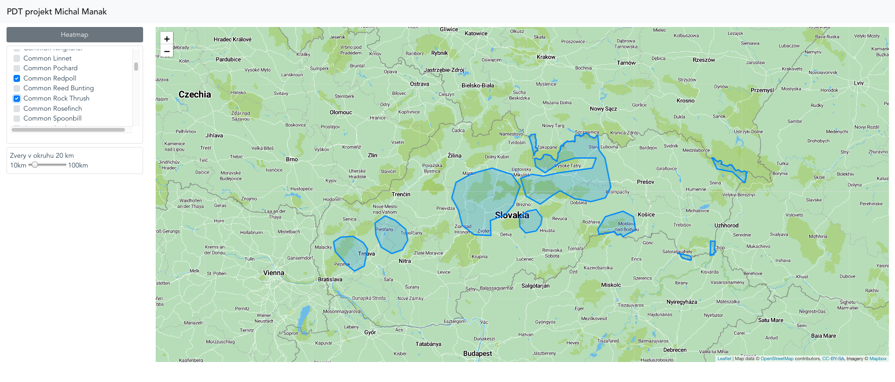
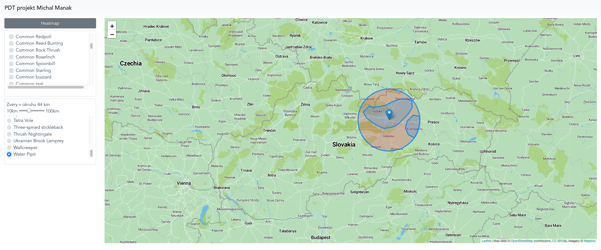

# Overview

This application shows animals occurence in Slovakia. Features of application are:
- search animals by chosen proximity to current location
- search intersection areas of animals occurence in slovakia (multiple intersection, not just 2)
- show heatmap of animal diversity in slovakia

Screenshots from application







Application consists of 3 parts. 
- postgres database server using postgis. 
- [backend server](#backend) written in Python Flask. This part is responsible for serving data from database (REST API using GeoJSON format mainly)
- [frontend application](#frontend) written in Vue.js. It contains Leaflet map using mapbox layout. It is responsible for geo data visualization in map.

# Frontend

Frontend application is written in Vue.js. It contains Leaflet map component filled by mapbox. Map is customised by using different color styles (more appropriate for nature domain) and hiding irrelevant elements.
I used [bootstrap-vue](https://bootstrap-vue.js.org/), [vue2-leaflet](https://www.npmjs.com/package/vue2-leaflet) and [vue2-leaflet-heatmap](https://github.com/jurb/vue2-leaflet-heatmap) libraries.

It has 2 main parts (components):
- main component (src/App.vue) - control bar on the left side of the application
- map component (src/components/Map.vue) - contains map and all required elements for showing geodata


# Backend

Backend is written in Flask (Python web framework) and its main responsibility is to expose geodata in [GeoJSON](http://geojson.org/) format to public, so that frontend can fetch it. It is using `ST_AsGeoJSON` for getting geodata from shapes and `json_build_object` for customising JSON to needed GeoJSON format.

## Data
Data about animals (chordates) comes from [IUCN Red List Organization](https://www.iucnredlist.org/), where I requested them. Data were in .shp format, I imported them using `shp2psql` to WSG84 schema.
They contained global occurences of animals that can be found in Slovakia. I created new table containing those data in Slovakia region only. 
Dataset contains only scientific names of animals, so I created script that fetch english names from [wikimedia](https://species.wikimedia.org/wiki/Main_Page) and adds them into db.


## Api

**Fetch names of animals found in Slovakia**

`GET /get_animals`

**Fetch polygon that is result of intersections between polygons of provided animals**

`GET /get_animal?name=[%22Alpine+Accentor%22,%22Alpine+Chough%22,%22Alpine+Marmot%22]`

**Fetch polygons of animals that can be found near point defined by lat and lng with given radius**

`GET /get_nearby?lat=48.610970750557364&lng=18.498650204737213&radius=53000`

**Fetch points ordered in rectangular grid with their intensity <0, 1> of animal diversity(how many different animals can be found at location of each point)**

`GET /get_heatmap`

### Response

API returns [GeoJSON](http://geojson.org/), where geometry key contains geodata (polygons, points, ..) and properties key contains additional info, e.g:
```
{
    type: "Feature",
    geometry: {
        coordinates: [ 21.7, 49.25], 
        type: "Point" 
    },
    properties: {   
        count: 0.20754716981132076 
    },
}
```
